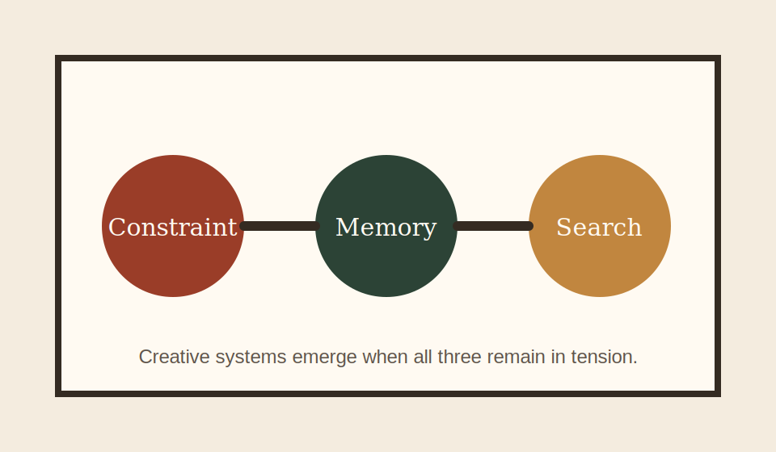

# On the Nature of Creative Systems

Creativity becomes easier to discuss once we stop treating it as magic. Systems produce novelty when they can absorb constraints, preserve memory, and still search a space larger than the one we can enumerate by hand.

<figure style="margin: 1.5rem 0;">
  
  <figcaption style="margin-top: 0.75rem; color: var(--muted-foreground); font-size: 0.9rem;">
    A local diagram loaded from the page's own <code>_media</code> folder.
  </figcaption>
</figure>

## Constraint Is Productive

The common mistake is to imagine that freedom produces creativity and restriction suppresses it. In practice, systems only become legible when they have structure. Constraints turn an undirected search into a shape.

## Memory Shapes Output

Any system that creates over time carries memory forward. That memory may be explicit, as in a training corpus or note archive, or implicit, as in habits encoded through repeated choices. Either way, novelty is never produced from nothing.

## Why This Matters

The point is not to flatten human work into a computational metaphor. The point is to describe creative work more honestly. What matters is not whether the source is human or machine, but how the system holds judgment, context, and revision together.
